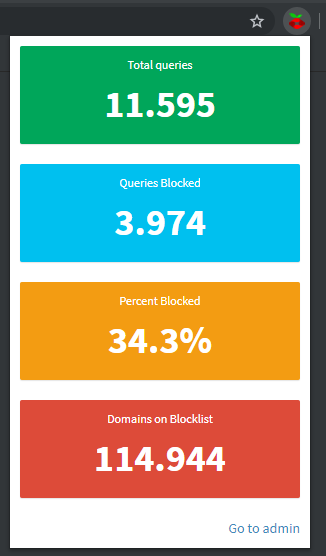

# Pi-hole stats for Google Chrome
Browser extension for Google Chrome to view your Pi-hole statis in one click.

## Installation
1. Clone the repository or download it as ZIP
2. Enable Developer Mode by clicking the toggle switch next to Developer mode.
3. Click the "Load Unpacked Extension" button and select the extension directory.
